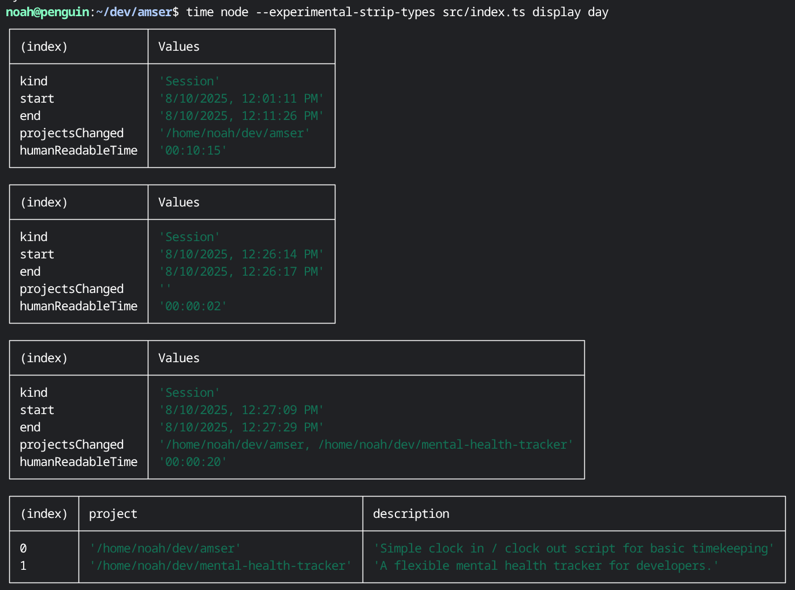

# amser

Simple clock in / clock out script for basic timekeeping.

## Install

```
npm install -g @eeue56/amser
```

or use via npx:

```
npx @eeue56/amser
```

## Usage

Start a session: `npx @eeue56/amser in`
End a session: `npx @eeue56/amser out`

Then use `npx @eeue56/amser display` to see the results.

## What

Keep track of what time you've spent on different projects. When you end a session, it will look in a directory (default: `$HOME/dev`) to identify any modified files in common code projects (`src`, `.git`, `.md` files, and `tests`).

This tool matches my personal workflow, where I often don't commit things with `git` until I've been doing a lot of big changes. Then I commit things piece-by-piece using `git commit -p`. So to keep track of changes without a `git log` to follow, I look at which projects have changed files and folders.

```
Usage: @eeue56/amser [command]
Available commands:  [ 'in', 'out', 'config', 'display' ]
in: Start a session
out: End a session
config: Create the first config
display: Display sessions within a given time period. day, week, month, year. Defaults to week

A simple way to keep track of time when working on different projects.
```

Example of what `display`'s output looks like:



## Default config

```typescript
const HOME = homedir();
const CONFIG_PATH = resolve(HOME, ".config/amser.json");
const DEFAULT_SESSION_PATH = resolve(HOME, "amser.json");
const DEFAULT_DEV_PATH = resolve(HOME, "dev");

const defaultConfig: Config = {
  pathToDevFolder: DEFAULT_DEV_PATH,
  pathToStoreSessions: DEFAULT_SESSION_PATH,
};
```

## Name

`amser` means time in Welsh. Part of the [Hiraeth](https://github.com/eeue56/hiraeth) collection.
